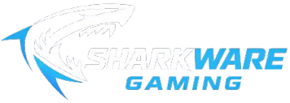

<div align="center">
  

  # Sharkware Gaming

  **Ecommerce de hardware gaming para el mercado argentino**

  
  
  
  
</div>

---

## Descripción

Sharkware Gaming es un prototipo de tienda online de componentes y periféricos gaming —notebooks, GPUs, monitores, RAM, almacenamiento y periféricos— orientado al mercado argentino. La aplicación implementa el flujo completo de un ecommerce: catálogo, búsqueda, filtros, carrito persistente, checkout con dos métodos de pago y panel administrativo.

El frontend está construido con **React 19 + Vite** y diseñado para integrarse en una segunda fase con un backend **Spring Boot 3 + MySQL 8**.

> [!NOTE]
> Esta versión es un **prototipo frontend estático**. Los datos viven en `src/data/` como arrays de JavaScript. El detalle del modelo de datos, los endpoints REST y las fases de integración con el backend están documentados en `CLAUDE.md`.

## Funcionalidades

- **Catálogo dinámico** con 13 productos en 8 categorías y galería de imágenes
- **Detalle de producto** con specs adaptativas por categoría y productos relacionados
- **Búsqueda** por nombre, marca y especificación (case-insensitive, substring)
- **Filtros combinables** por categoría, marca y rango de precios, persistidos en la URL
- **Ordenamiento** por relevancia o precio (ascendente / descendente)
- **Paginación** con URL persistente y normalización automática de páginas inválidas
- **Carrito persistente** con `Context API` + `useReducer` + `localStorage`
- **Checkout** con MercadoPago (sandbox) y cotización en criptomonedas (BTC/ETH/USDT)
- **Panel administrativo** con CRUD completo de productos (ruta protegida)
- **Diseño responsive** mobile-first con un único breakpoint en 768px
- **Code splitting** de la ruta `/admin` para optimizar el bundle inicial

## Stack tecnológico

| Capa | Herramienta | Versión |
|---|---|---|
| Framework | React | 19.2 |
| Routing | React Router DOM | 7.14 |
| Estilos | Tailwind CSS (via `@tailwindcss/vite`) | 4.2 |
| Iconos | Lucide React | 1.8 |
| Build tool | Vite | 8.0 |
| Estado global | Context API + `useReducer` + `localStorage` | — |

El stack se mantuvo deliberadamente minimalista —sin TypeScript, sin Redux, sin axios, sin librerías de formularios— para enfatizar dominio del fundamento de React puro con hooks.

## Cómo correr el proyecto

### Pre-requisitos

- Node.js 18 o superior
- npm 9 o superior

### Instalación

```bash
git clone https://github.com/Mondati/Sharkware-Gaming.git
cd Sharkware-Gaming
npm install
npm run dev
```

El sitio queda disponible en `http://localhost:5173`.

### Scripts disponibles

| Comando | Descripción |
|---|---|
| `npm run dev` | Servidor de desarrollo con Hot Module Replacement |
| `npm run build` | Build optimizado para producción |
| `npm run preview` | Preview del build de producción |
| `npm run lint` | Análisis estático con ESLint |

### Credenciales de prueba

> [!TIP]
> La autenticación es mock —se valida contra valores hardcodeados y el rol queda en `localStorage`. Será reemplazada por `HttpSession` + `BCryptPasswordEncoder` en la fase backend.

## Historias de usuario

| HU | Descripción | Estado |
|---|---|---|
| HU1 | Ver catálogo de productos | Completa |
| HU2 | Ver detalle de producto | Completa |
| HU3 | Navegación multinivel por categorías | Completa |
| HU4 | Buscar productos por nombre | Completa |
| HU5 | Filtrar por categoría, marca y precio | Completa |
| HU6 | Ordenar por precio o relevancia | Completa |
| HU7 | Paginación de resultados | Completa |
| HU8 | Agregar al carrito | Completa |
| HU9 | Ver carrito | Completa |
| HU10 | Modificar carrito (cantidad + eliminar) | Completa |

## Decisiones de diseño

- **Mobile-first responsive** con un único breakpoint Tailwind (`md:` 768px). Cada componente tiene dos versiones completas en lugar de ocultar elementos individuales.
- **Padding lateral dinámico** vía hook `useWindowWidth` —escala de 40px en tablet a 400px en pantallas 4K— para mantener líneas de lectura cómodas en todos los viewports.
- **Estilos inline con paleta hardcodeada**: Tailwind se reserva exclusivamente para layout y utilidades responsive; los colores son `style={{}}` para mantener consistencia visual estricta.
- **`CartContext` con `useReducer` + `localStorage`** como única fuente de verdad. El carrito sobrevive a recargas de página.
- **URL como estado**: filtros, búsqueda, ordenamiento y paginación viven en `useSearchParams`, lo que permite compartir y bookmarkear estados específicos del catálogo.
- **Code splitting selectivo** de `/admin` con `React.lazy` + `Suspense` —el panel administrativo no entra al bundle inicial.

## Métodos de pago

| Método | Estado de integración |
|---|---|
| MercadoPago | Sandbox previsto en fase backend (preference + webhook) |
| Cripto (BTC/ETH/USDT) | **Solo cotización informativa** —no es un método de pago real |

> [!WARNING]
> El flujo de checkout con criptomonedas muestra QR, dirección y countdown, pero **no verifica la transacción on-chain**. La cotización se obtiene de una API pública (CoinGecko/Binance) para mostrar el equivalente en tiempo real al usuario. La confirmación queda en estado `PENDING` hasta que un admin la marca manualmente como `PAID` desde el panel.

## Roadmap

- [x] **Fase 1** — Frontend estático con datos mock (HU1–HU10)
- [ ] **Fase 2** — Backend Spring Boot 3 + MySQL 8, auth con `HttpSession` + `BCrypt`
- [ ] **Fase 3** — Integración real de MercadoPago (sandbox) + endpoint de cotización cripto
- [ ] **Fase 4** — Conexión frontend ↔ backend (`src/api/`, fetch wrappers con `credentials: 'include'`, loading states, manejo de errores)

> [!IMPORTANT]
> El detalle completo del modelo de datos (7 entidades), los endpoints REST y las fases de implementación del backend está documentado en `CLAUDE.md`.

## Contexto académico

Proyecto desarrollado como trabajo final integrador, aplicando el ciclo completo de análisis (definición de historias de usuario), diseño (mockups y paleta de marca) e implementación (frontend funcional listo para integrarse a un backend Java).
